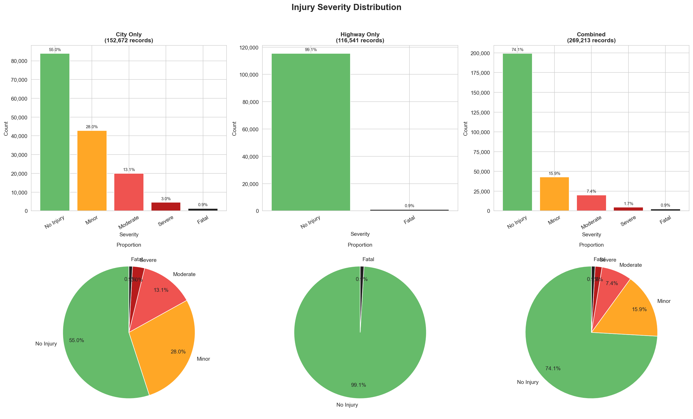
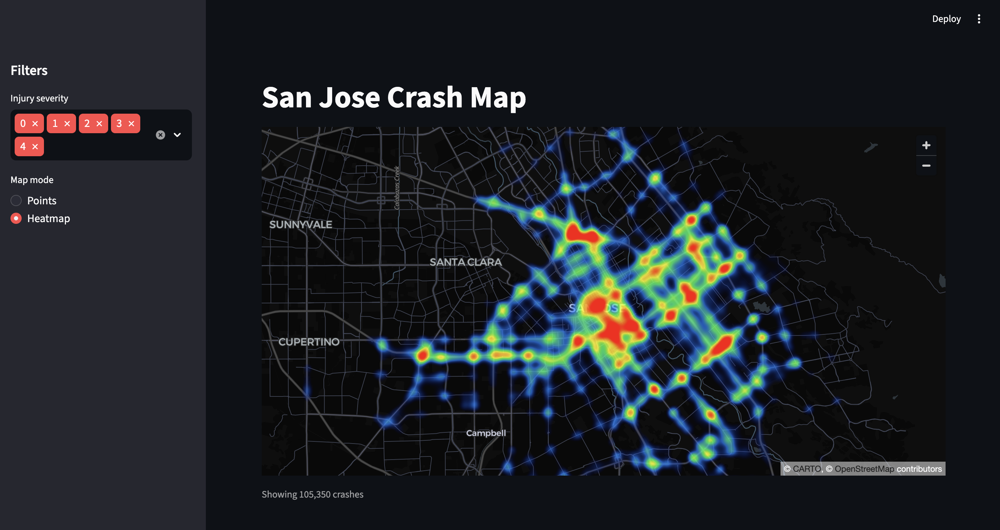
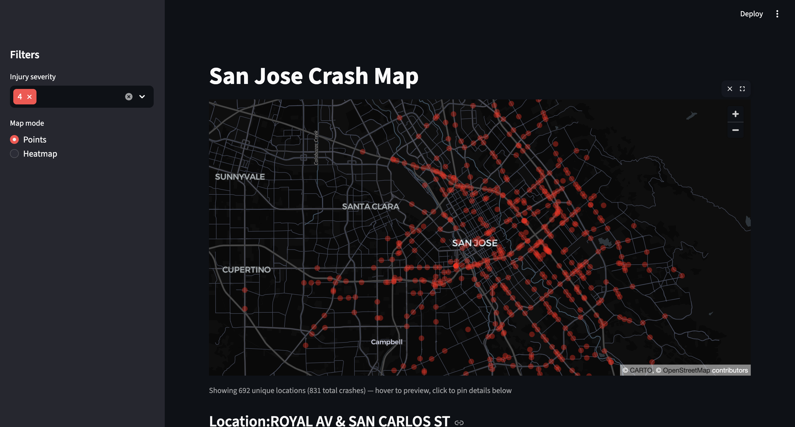

# Traffic Crash Severity Prediction — San Jose, CA

Predicting injury severity of traffic crashes in San Jose using SJPD and CHP data, machine learning, and an interactive map.


## Abstract

We merged 269,213 crash records from the San Jose Police Department (2011–2024) and the California Highway Patrol's SWITRS system (2016–2024) and predicted crash injury severity on a five-class scale (0 = no injury, 4 = fatal) using features observable at or before the time of the crash: location, weather, time of day, collision type, and driver sobriety. Random Forest reached **64% accuracy** with a **macro F1 of 0.387** on a held-out test set; geographic location and time of day drove most of the predictive signal. We also shipped a Streamlit web app that lets planners and residents explore crash hotspots across the city on an interactive map.

> **Full report:** [reports/traffic_crash_severity_report.pdf](reports/traffic_crash_severity_report.pdf) · [Markdown source](reports/traffic_crash_severity_report.md)

**Authors:** Eugene Lacatis, Rosnita Dey, Peter Conant, Faye Yang
**Course:** CMPE 255 Data Mining · San Jose State University · Spring 2026

---

## Headline Results

| Model         | Accuracy | Macro F1   | Severe+Fatal Recall |
|---------------|---------:|-----------:|--------------------:|
| GaussianNB    |     0.53 |      0.255 |               0.037 |
| CategoricalNB |     0.64 |      0.360 |               0.120 |
| Random Forest |     0.64 |  **0.387** |           **0.131** |


### Key Findings

- **Location is the strongest signal.** Latitude and longitude account for ~47% of Random Forest feature importance — crashes cluster on Tully Road, Story Road, Capitol Expressway, and the downtown core.
- **The class imbalance is brutal.** No-Injury vs. Fatal sits at 63.6:1, so accuracy is misleading; we report macro F1 and minority-class recall instead.
- **Late nights skew severe.** Crashes peak at 5 PM Friday, but midnight–4 AM produces a disproportionate share of severe and fatal injuries.
- **Naive Bayes was the wrong tool.** Categorical features correlate heavily (sobriety ↔ lighting ↔ weather ↔ surface), violating independence; the Categorical variant also can't ingest lat/lon at all.



---

## Webapp

A Streamlit + pydeck app for exploring crash hotspots interactively.

| Heatmap mode | Point mode (filtered to fatal) |
|---|---|
|  |  |

Click any point to open a detail card with crash characteristics, injuries, and road and environment conditions. Severity-class filter lives in the left sidebar.

```bash
conda activate crash-severity
streamlit run webapp/app.py
```

---

## Data

| Source | Records | Years | Coverage |
|---|---:|---|---|
| SJPD (City of San Jose Open Data) | 152,731 | 2011–2024 | City streets · full 5-class severity |
| CHP / SWITRS (Santa Clara County) | 116,482 | 2016–2024 | Highways · binary severity |
| **Merged dataset** | **269,213** | 2011–2024 | After deduplication |

- SJPD source: <https://data.sanjoseca.gov/dataset/crashes-data>
- SWITRS supplement integrated via `scripts/integrate_highway_data.py` to fill the highway gap (SJPD records cover <0.2% of freeway crashes).
- Multiclass modeling uses SJPD-only records; SWITRS records keep a binary severity label and are used for geographic analysis only. Section II of the report covers this in detail.

---

## Repository Layout

```
.
├── README.md
├── environment.yml
├── data/
│   ├── raw/                  # Source CSVs (SJPD + SWITRS)
│   └── processed/            # merged_crash_vehicle_data.csv
├── notebooks/
│   ├── 01_data_inspection.ipynb
│   ├── 02_eda.ipynb
│   ├── 03_eda_comparative.ipynb
│   └── 05_naive_bayes_analysis.ipynb
├── src/
│   ├── data/                 # Loading, cleaning, splitting
│   ├── features/             # Feature engineering
│   ├── models/               # Training, prediction
│   └── visualization/        # Plots
├── scripts/
│   └── integrate_highway_data.py
├── webapp/
│   └── app.py                # Streamlit + pydeck map
├── reports/
│   ├── traffic_crash_severity_report.pdf
│   ├── traffic_crash_severity_report.md
│   └── figures/              # All figures referenced by the report
└── docs/                     # Setup, workflow, decisions, meeting notes
```

---

## Quick Start

```bash
git clone <repo-url>
cd CMPE255_TrafficCrashSeverityIndicator

conda env create -f environment.yml
conda activate crash-severity

# Run the webapp
streamlit run webapp/app.py

# Or open the analysis notebooks
jupyter lab notebooks/
```

---

## Acknowledgments

Thanks to **Prof. Jung Suh** (CMPE 255, SJSU) for guidance throughout the semester. SJPD crash data is maintained by the City of San Jose Open Data Team; highway data comes from the California Highway Patrol's SWITRS system. Built with scikit-learn, Streamlit, pydeck, pandas, and matplotlib.
