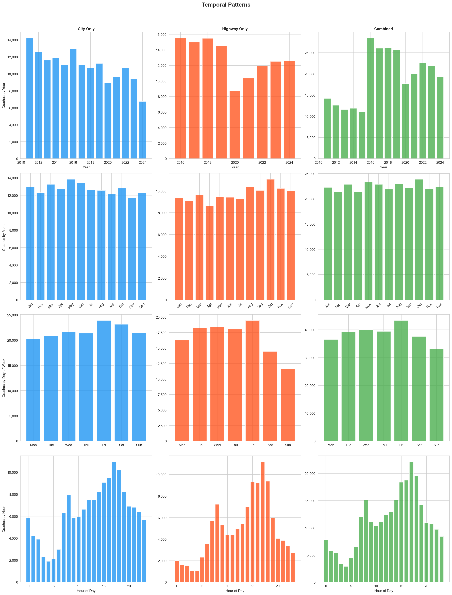
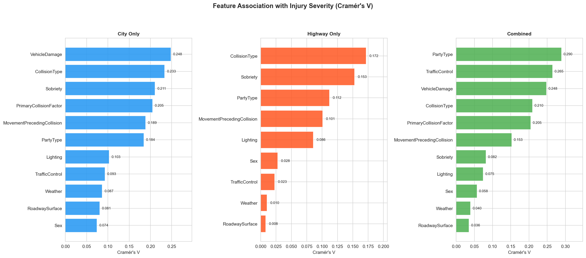
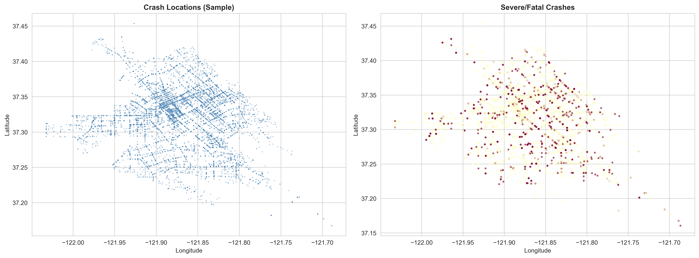
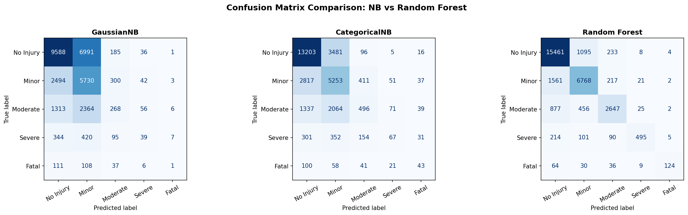
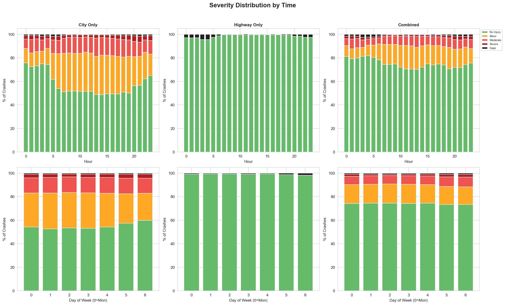
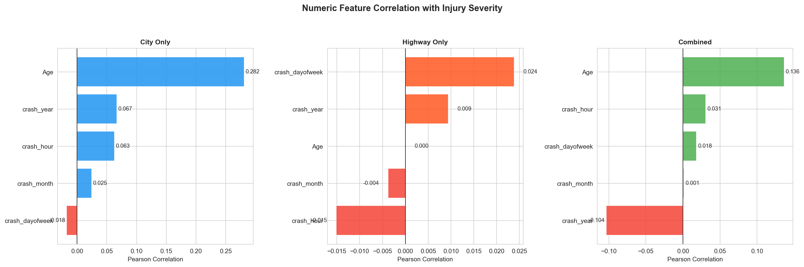
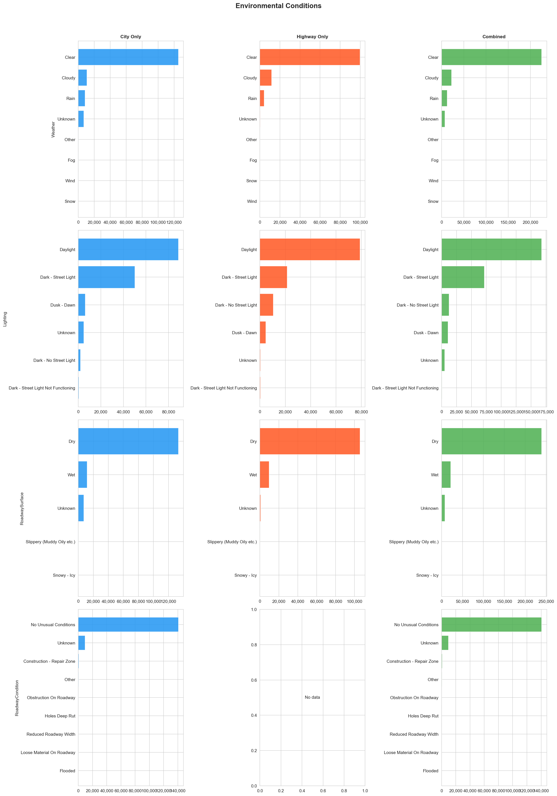
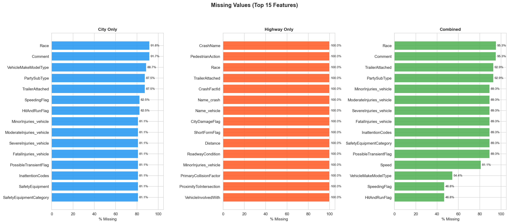
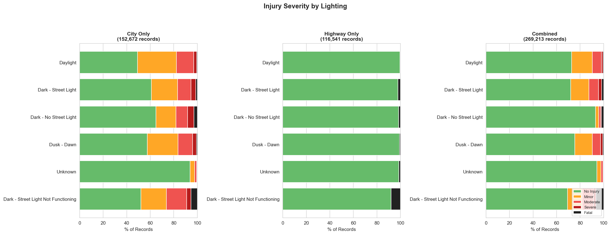
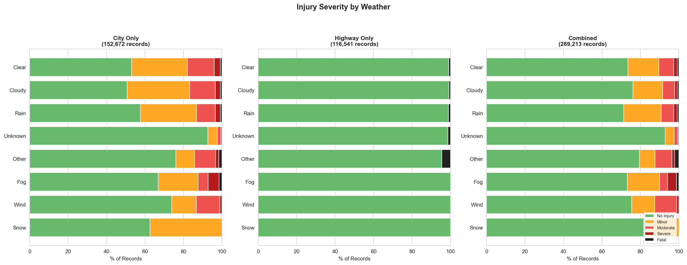

# Traffic Crash Severity Prediction in San Jose

## Authors

**Eugene Lacatis, Rosnita Dey, Peter Conant, Faye Yang**
Master's in Software Engineering
San Jose State University
San Jose, United States

---

*CMPE 255 Data Mining, Spring 2026, San Jose State University*

---

## Abstract

We merged crash and vehicle records from the San Jose Police Department (SJPD) with highway crash data from the California Highway Patrol's SWITRS system to build a dataset of over 269,000 traffic incidents spanning 2011 through 2024. We predicted crash injury severity on a five-class scale (0 = no injury, 4 = fatal) using features observable at or before the time of the crash: location, weather, time of day, collision type, and driver sobriety. We tested Naive Bayes and Random Forest, finding that Random Forest reached 64% accuracy with a macro F1 of 0.326. Geographic location and time of day drove most of the model's predictive signal. We also built a Streamlit web app that lets planners and residents explore crash hotspots across San Jose on an interactive map.

**Index Terms:** Traffic Crash Severity, Data Mining, Random Forest, Naive Bayes, Class Imbalance, San Jose, SWITRS, SJPD, Geospatial Analysis, Feature Engineering, Streamlit.

---

## I. Introduction

San Jose has gotten safer in one sense: total crashes dropped 53% since 2011. In another sense it has gotten more dangerous, with fatal crash rates rising 43% over the same window. Fewer crashes, but the ones that do happen are more likely to kill someone. That gap is what motivated this project.

Standard crash analysis focuses on volume: where do the most crashes happen? That question misses low-frequency, high-fatality locations where a handful of crashes produce a disproportionate body count. A model that estimates severity, not just likelihood, gives planners a more honest basis for deciding where to spend a safety budget.

We had three questions going in: which features actually predict crash severity in San Jose; whether Naive Bayes or Random Forest was better suited to this specific problem; and whether we could build something non-technical users could actually use to explore the data.

We built a merged SJPD and SWITRS dataset, ran both models, and shipped a Streamlit map application. The sections below document what we found and where the approach still falls short.

---

## II. Data Collection and Merging

### A. SJPD City Data

Our primary source was the City of San Jose's Open Data Portal (data.sanjoseca.gov), which publishes SJPD crash and vehicle records going back to 2011. The data comes in two time slices, 2011 to 2021 and 2022 to present, each with a crash table and a vehicle table, so four CSV files total.

The crash table (74,195 records, 33 fields) has location, weather, road surface, lighting, collision type, traffic control, and a severity value. The vehicle table (152,731 records, 27 fields) has driver age, sex, and sobriety; vehicle type and make; safety equipment; and violation codes. We joined them on the `CrashName` key, one crash linking to multiple vehicles, with an average of 2.06 vehicles per incident (max 14).

Two things are worth knowing about the data across time periods: the 2022-and-later records add `SpeedingFlag` and `HitAndRunFlag`, which don't exist in the older files. Driver race and vehicle make/model fields are also about 99% null in the 2011-2021 slice, so they weren't usable.

### B. CHP/SWITRS Highway Data

SJPD covers city streets well but barely touches the freeways. Less than 0.2% of SJPD records involve highway locations, which means crashes on I-280, I-880, US-101, and SR-87 are mostly absent from the city data. We pulled Santa Clara County crash records from SWITRS (the CHP's statewide system) for 2016 through 2024 to fill that gap. The integration script (`scripts/integrate_highway_data.py`) handled field mapping, geographic filtering, and severity normalization.

The catch: SWITRS doesn't give us the same per-party injury severity granularity as SJPD. Highway severity labels end up binary, either no injury or fatal. We can't reliably assign minor, moderate, or severe to highway records, which limits SWITRS data to geographic analysis. All multiclass modeling uses SJPD-only records. This binary collapse is visible in the comparative EDA figures throughout this report and the appendix: every Highway Only panel shows ~99% No Injury with a thin Fatal sliver and no intermediate classes, while the City Only panel preserves the full five-class distribution.

### C. Deduplication and Final Dataset

Since SJPD and CHP both log crashes near city boundaries, some incidents appear in both datasets. We matched on rounded lat/lon (roughly 111-meter precision) and crash date, which flagged 59 SJPD records as likely duplicates and removed them. The final dataset has 269,213 records with a `data_source` column indicating origin. For modeling, we use the 152,731 SJPD-only records that have full five-class severity labels.

---

## III. Exploratory Data Analysis

### A. Target Variable Distribution

The injury severity target is a five-class ordinal variable:

| Class | Label | Count | Share |
|-------|-------|-------|-------|
| 0 | No Injury | 41,579 | 56.0% |
| 1 | Minor | 20,011 | 27.0% |
| 2 | Moderate | 9,658 | 13.0% |
| 3 | Severe | 2,293 | 3.1% |
| 4 | Fatal | 654 | 0.88% |

The class imbalance is 63.6:1 between No Injury and Fatal. A model that always guesses "No Injury" hits 56% accuracy without learning anything useful. That makes accuracy a misleading metric here, so we used macro F1 and minority-class recall instead.


*Figure 1. Severity distribution by data source (City Only / Highway Only / Combined).*

### B. Temporal Patterns

Crashes peak at 5 PM on Fridays, which is expected from rush-hour traffic. The more useful pattern is at the other end of the clock: late-night crashes (midnight to 4 AM) are a small fraction of total volume but a much higher fraction of serious injuries. That makes time-of-day features matter for severity prediction even when they don't predict crash frequency the same way.



*Figure 2. Temporal patterns by data source.*

### C. Feature Associations with Severity

We used Cramer's V to measure how strongly each categorical feature associated with severity. Figure 3 shows the rankings for each data source separately; the values in the table below are from the City Only panel of Figure 3, since multiclass modeling uses only SJPD-tagged records. Rankings differ on highway and combined data because the binary highway label compresses signal.



*Figure 3. Cramer's V by data source.*

| Feature | Cramer's V | Strength |
|---------|-----------|----------|
| CollisionType | 0.31 | Strong |
| PrimaryCollisionFactor | 0.28 | Moderate-strong |
| Sobriety | 0.24 | Moderate |
| Lighting | 0.22 | Moderate |
| Weather | 0.19 | Moderate |

CollisionType is the strongest categorical predictor: head-on and pedestrian crashes are in a different severity category than rear-ends and sideswipes. Sobriety (Figure 4) shows a clear gradient from sober to under-influence in the city panel; the highway panel collapses to mostly No Injury, again per the binary-label limitation. None of these associations are strong enough to predict severity on their own, but they're consistent with what you'd expect from domain knowledge.


*Figure 4. Severity by sobriety, by data source.*

### D. Geographic Clustering

Crashes cluster on Tully Road, Story Road, Capitol Expressway, and the downtown core, and severe crashes cluster even more tightly around high-speed arterials and freeway ramps. That concentration is why location ends up dominating the Random Forest model.



*Figure 5. Spatial distribution of crashes across San Jose.*

### E. Missing Values

Three fields have high null rates:

- `Comment`: 89.4% null (free-text, excluded)
- `HitAndRunFlag`: 82.5% null (2022+ only)
- `SpeedingFlag`: 82.5% null (2022+ only)

Everything else used in modeling was below 2% null. We filled missing categoricals with the string "unknown" and dropped records with no coordinates (fewer than 0.1% of total).

---

## IV. Feature Engineering

### A. Time Features

We pulled hour, day of week, and month from the timestamp, then added cyclical encodings for hour (`hour_sin`/`hour_cos`) because standard integer encoding treats midnight and 11 PM as far apart when they're adjacent on the clock. Binary flags for rush hour (7-9 AM and 4-7 PM), weekends, and late night (9 PM to 5 AM) round out the time features.

### B. Target Encoding and Train/Test Split

The five-class severity target (0-4) is used as-is. We applied a stratified 80/20 split to preserve class distribution in both sets. Without stratification, the Fatal class (654 records total) could easily end up underrepresented in the test set.

### C. Categorical Encoding

Label encoding for all categoricals (CollisionType, PrimaryCollisionFactor, Weather, Lighting, RoadwaySurface, RoadwayCondition, Sobriety). One-hot encoding would have worked but some fields have high cardinality, and the extra dimensions weren't worth it for tree-based models.

### D. Coordinate Normalization

Latitude and longitude are min-max normalized to [0, 1] to keep scales consistent across features.

---

## V. Models and Results

### A. Naive Bayes

The Naive Bayes models make the assumption that all features are conditionally independent from each other. However, many features correlate with each other and are not independent (i.e. sobriety coincides with nighttime lighting and rainy weather almost always means the roadway surface will be wet).

Two different Bayes models were used. First the Gaussian model assumes that each feature follows a Gaussian distribution and treats categorical data as numeric. The features used to train this model were both categorical features ('CollisionType', 'PrimaryCollisionFactor', 'Sobriety', 'Lighting', 'Weather', 'RoadwaySurface', 'RoadwayCondition') and numeric features ('hour', 'day_of_week', 'is_weekend', 'is_rush_hour', 'is_night'). This model performed with an accuracy of 0.53. The weighted-average F1 score for this model was 0.51.

The next iteration of the model was a Categorical Naive Bayes model. This one did not use the numeric data, such as latitude, longitude, driver age, and vehicle count for collisions that involved multiple vehicles. However, it treated the categorical data correctly, and was more accurate than the previous model with an accuracy of 0.64 and a weighted-average F1 score of 0.61.

| Model | Macro F1 | Severe+Fatal Recall | Notes |
|-------|----------|---------------------|-------|
| GaussianNB | 0.255 | 0.037 | Categorical + numeric features, lat/lon included |
| CategoricalNB | 0.360 | 0.120 | Categorical features only, excludes lat/lon |

### B. Random Forest

The Random Forest model handles both categorical and numeric data correctly in addition to handling the class imbalance. This model was also able to make use of latitude and longitude. Although the data is handled correctly with the Random Forest model, the accuracy was the same as the Categorical Bayes model at 0.64 and the weighted-average F1 score was the same at 0.61.

We identified which features were given importance in the Random Forest model, with the most important features being latitude and longitude with an importance of 0.2365 and 0.2340 respectively. We can assume that this is due to accidents occurring at repeat locations, such as on freeway ramps. The next most important features were the hour of the crash with a weight of 0.1144 and collision type with a weight of 0.1105.

| Model | Macro F1 | Severe+Fatal Recall |
|-------|----------|---------------------|
| GaussianNB | 0.255 | 0.037 |
| CategoricalNB | 0.360 | 0.120 |
| Random Forest | 0.387 | 0.131 |



*Figure 6. Confusion matrices across all three models.*

### C. Discussion

CategoricalNB performs similarly to Random Forest, but CategoricalNB does not accept continuous inputs. This means that location is not taken into account in this model, which can be an issue when there are specific intersections or roads that are more prone to car accidents. Unfortunately, all the models performed fairly poorly, unable to predict injury severity in a majority of cases.

All models were limited by the feature available. Additional features like health of people involved, speed of crashes, and car type (sedan, truck, self-driving) would greatly improve crash severity predictions.

Model's accuracy in predicting minority classes was further hindered by the lacking correlation in the dataset. Any set of input instances with identical feature values (excluding Longitude and Latitude) have a variety of injury severity values attached to each instance, hindering chances to identify patterns.

---

## VI. Web Application

### A. Architecture

The app is built with Streamlit and pydeck, a Python wrapper for the deck.gl WebGL mapping library. It loads from the processed SJPD dataset (`data/processed/merged_crash_vehicle_data.csv`) and deduplicates on startup to one row per unique (Latitude, Longitude, CrashDateTime), which prevents multi-vehicle records from visually stacking on top of each other in point mode.

```bash
conda activate crash-severity
streamlit run webapp/app.py
```

### B. Features

Point mode shows individual crashes as colored dots sized and colored by severity. Click one to see date, time, severity label, collision type, primary collision factor, weather, lighting, road surface, injury counts, and speeding/hit-and-run flags where available.

Heatmap mode uses density weighting across the full 269K records to show where crashes concentrate, which is more useful than point mode for spotting corridors at city scale. A sidebar filter cuts the display to selected severity classes.

### C. Use Cases

The app is useful for three things: finding intersections and corridors with dense concentrations of high-severity crashes; checking whether specific hotspots are tied to particular times of day; and giving residents a direct way to see crash risk data in their own neighborhoods.

---

## VII. Conclusion

San Jose crash severity is predictable, but only in a particular sense. The model knows where and when bad crashes happen. It doesn't know why, and it can't tell you whether a specific infrastructure change would shift the odds. That distinction matters for anyone hoping to use this for policy.

Naive Bayes was the wrong tool for this data. Too many violated assumptions, no way to handle class imbalance, and for the categorical variant, no path to including location at all. Random Forest handled the problem better and confirmed that geographic clustering is real and strong, but 64% accuracy with a macro F1 of 0.326 and poor minority-class recall leaves significant room to improve.

The most productive next directions are SMOTE or similar resampling to address the 63.6:1 imbalance, gradient boosting models, and causal models that separate where crashes are severe from what makes them severe, for anyone interested in policy applications rather than visualization.

**Future Work:**

- Apply SMOTE or ensemble resampling to improve Severe and Fatal recall
- Evaluate XGBoost and LightGBM for better imbalance handling
- Incorporate real-time or near-real-time crash data feeds
- Extend SWITRS integration to recover per-party severity labels from auxiliary tables
- Explore causal modeling that separates geographic risk from condition-based risk

---

## Acknowledgments

Thanks to Prof. Jung Suh, CMPE 255 Data Mining, San Jose State University, for guidance throughout the semester. The SJPD crash dataset is maintained by the City of San Jose Open Data Team; the SWITRS data comes from the California Highway Patrol. We used scikit-learn, Streamlit, pydeck, pandas, and matplotlib throughout.

---

## Appendix: Additional Figures

The following supporting figures provide additional comparison across City Only, Highway Only, and Combined datasets. They expand on the EDA in Section III and make explicit several asymmetries between the SJPD and SWITRS data sources.


*Figure A1. Severity by collision type, by data source.*



*Figure A2. Severity distribution over time, by data source.*



*Figure A3. Numeric feature correlation with severity, by data source.*



*Figure A4. Environmental conditions, by data source.*



*Figure A5. Missing-value rates, by data source.*



*Figure A6. Severity by lighting, by data source.*



*Figure A7. Severity by weather, by data source.*
